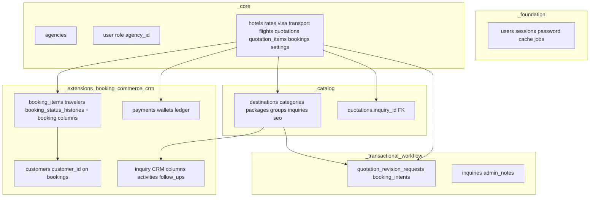

# Database migration architecture

## Goals

- **Predictable dependency order** via migration basenames (timestamps) and a clear **layer model**.
- **Production-grade** separation: core identity + catalog vs transactional vs extensions (integrations, CRM, audit).
- **Normalized booking model** documented below; heavy schema splits are deferred to avoid breaking existing installs.
- **Scaling**: composite indexes for list/report queries; guidance for high-volume log tables.

## How Laravel orders migrations

The migrator collects all `*_*.php` files from every registered path, then sorts by **migration name** = **filename without `.php`**, ignoring directory. Subfolders do **not** change order; only the basename matters.

Registered paths (see `AppServiceProvider::boot()`):

1. `_foundation`
2. `_core`
3. `_catalog`
4. `_transactional_workflow`
5. `_extensions_cms_audit`
6. `_extensions_integrations`
7. `_extensions_booking_commerce_crm`
8. `_extensions_operational`

The default `database/migrations` root is still scanned; keep it for quick `make:migration` output, then move files into a layer folder.

## Dependency graph (must remain satisfied by basename order)

**Critical ordering facts**

- `agencies` and `users` (extended) exist before any `foreignId` to them.
- `quotations` is created **before** `inquiries`; `inquiry_id` FK is added in `_catalog` after `inquiries` exists.
- `bookings` base row exists in `_core`; line items, travelers, and history come in `_extensions_booking_commerce_crm`.
- Payments reference `bookings` and `agencies`; B2C adds `customers` then `bookings.customer_id`.
- CRM extends `inquiries` and adds child tables.

## Booking normalization (current design)

| Concept | Location | Note |
|---------|----------|------|
| Commercial document | `quotations` + `quotation_items` | Source of priced offer |
| Operational reservation | `bookings` + `booking_items` | Snapshot of line items at conversion; **immutable pricing intent** |
| Passengers | `travelers` | **Canonical passenger manifest** (first name, passport, etc.) |
| Primary contact snapshot | `bookings.customer_*` | Denormalized **legal/ops snapshot** at booking time (invoicing, support); not a replacement for `travelers` |
| B2C account link | `bookings.customer_id` | Optional link to `customers`; does not remove need for traveler rows |

**Intentional denormalization:** `bookings.total_amount`, `currency`, and customer contact fields may mirror quotation data to preserve a **point-in-time** record if the quote changes later. The **manifest** remains normalized in `travelers`.

**Future hardening (optional migrations):** nullable `bookings.primary_traveler_id` → `travelers.id` to tie invoice “lead guest” to a row; keep text snapshot for legal PDFs.

## Scaling and operational risks

| Risk | Mitigation |
|------|------------|
| Large `sessions` table | Use `SESSION_DRIVER=database` only if trimmed; prefer Redis/database with TTL in production |
| `integration_*_logs` growth | Partition/archive by `created_at`; consider separate DB or object storage for raw bodies long-term |
| `export_histories` / audit tables | Index `(type, created_at)` (already on exports); retention policy |
| Admin list slowdown | **`2026_12_01_000000_add_operational_indexes_for_scale`** adds composites on `bookings`, `inquiries`, `quotations`, `payments` |
| `quotation_id` → `bookings` **cascadeOnDelete()** | Deleting a quotation **drops** bookings; acceptable only if quotations are never hard-deleted in production—prefer soft-delete or restrict |

## Drift between disk and `migrations` table

Symptoms: “table already exists” or “table not found” during `migrate`.

- **Fix dev:** `php artisan migrate:fresh` (destructive) or manually align `migrations` rows with reality.
- **Fix prod:** Run missing migrations only; never `fresh`. For partial applies, repair `migrations` under DBA review.

## Changing this structure

1. New migration → choose the smallest layer folder that fits; basename timestamp **after** latest migration so it runs last.
2. Do **not** rename existing migration basenames on production DBs without renaming rows in `migrations`.
3. After structural changes, update **`database/migrations/README.md`** and this doc.

## Related docs

- `docs/22-schema-baseline-and-api.md` — schema dump workflow, public UUIDs, index strategy
- `docs/15-db-schema-summary.md` — table index
- `docs/14-environment-and-deployment.md` — deploy / migrate notes
- `docs/17-booking-engine.md` — booking lifecycle
